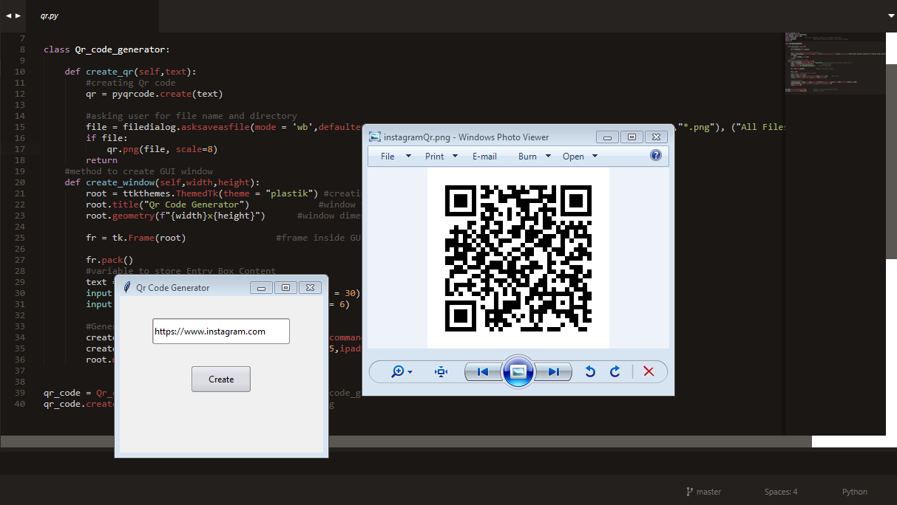

# Qr Code Generator
**Generate Qr code from passed text or link, and save them as PNG image format in a single click**

# Requires:
- [pyqrcode](https://pypi.org/project/PyQRCode/) Library (pip install pyqrcode)
- [ttkthemes](https://pypi.org/project/ttkthemes/) Library (pip install ttkthemes)

